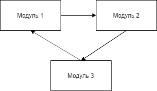

### 
Тема: Бази даних

### 
План

- Типи баз даних
- СУБД
- Нормалізація БД

### 
План

 
 

- `<u>Текст</u>` - <u>Текст</u>
- `<b>Текст</b>` - <b>Текст</b>
- `<s>Текст</s>` - <s>Текст</s>
- `[Text](http://instagram.com)` - [Text](http://instagram.com)
- `<i>Текст</i>` - <i>Текст</i>

A First Level Header
====================

A Second Level Header
---------------------

Now is the time for all good men to come to
the aid of their country. This is just a
regular paragraph.

The quick brown fox jumped over the lazy
dog's back.

### Header 3

> This is a blockquote.
> 
> This is the second paragraph in the blockquote.
>
> ## This is an H2 in a blockquote

I strongly recommend against using any `<blink>` tags.

I wish SmartyPants used named entities like `&mdash;`
instead of decimal-encoded entites like `&#8212;`

> Привіт
> Привіт
> ### Привіт

This is a normal paragraph:

    const express = require('express');

    const app = express();

    app.listen(procces.env.PORT|| 3000, () =>{
        console.log('server runed o')
    }) 

| 2 | 10 |
| ---- | -- |
| 0000 | 0 |
| 0001 | 1 |
| 0010 | 2 |
| 0011 | 3 |
| 0100 | 4 |
| 0101 | 5 |
| 0110 | 6 |
| 0111 | 7 |
| 1000 | 8 |
 

