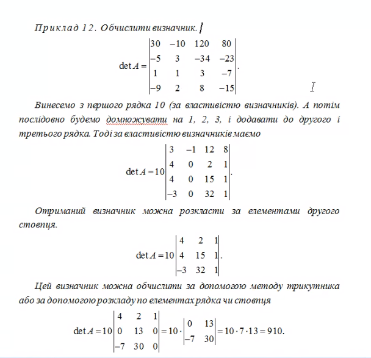
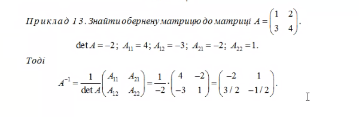

# 
Вступ

0938741363 -  Коломієць Альона Анатолієвна

> Для того щоб утворити нулі в рядку потрібно додавати стовпці, і для того, щоб утворити нулі у стовпчику потрібно додавати рядки.

### 
Приклад 12

- det A = [

|||||
|-|-|-|-|
|30|-10|120|80|
|-5|3|-34|-23|
|1|1|3|-7|
|-9|2|8|-15|

]

> Виносим 10 з першого рядка

> Додаєм перший радок до інших
- det A 10 * [

|||||
|-|-|-|-|
|3|-1|12|8|
|4|0|2|1|
|4|0|15|1|
|-3|0|32|1|

]

> залишаєм алгебраїчне доповнення

- det A 10 * [

||||
|-|-|-|
|4|2|1|
|4|15|1|
|-3|32|1|

]

- det A 10 * [

||||
|-|-|-|
|4|2|1|
|4|15|1|
|-3|32|1|

] = 10 * 7 * 13 = 910

### 
Приклад 13

> !!! В загальному випадку множення матриць не комутативне