# 
Вступ

# 
План

## Завдання ДО

# Модель

## Застосування моделей

## Види моделей

## Математичні моделі

# Дослідження операцій
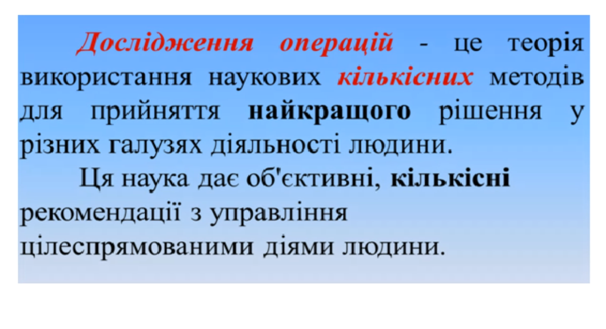

# Вчені

## Томас Сааті
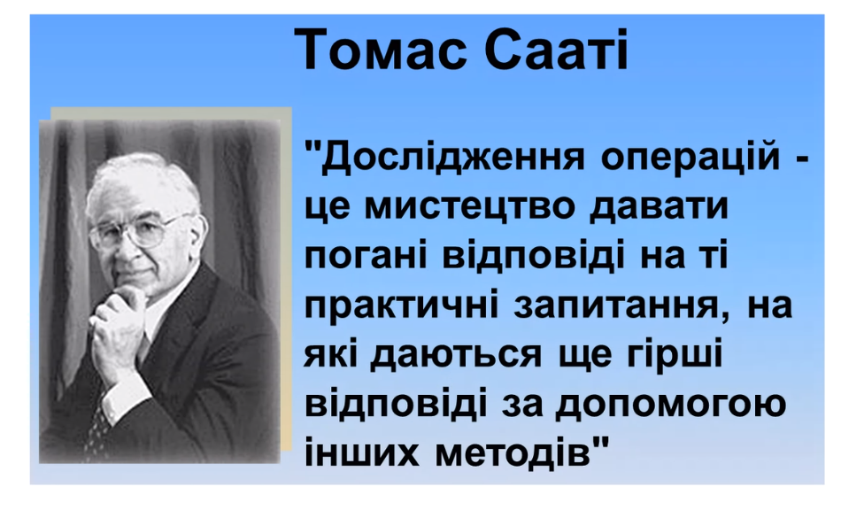

## Ше пару вчених
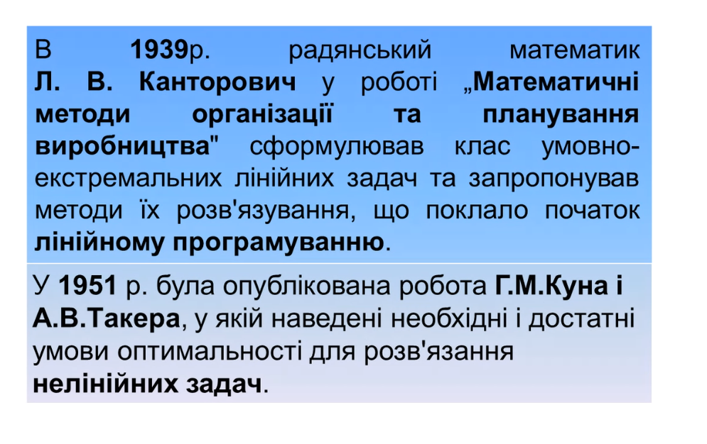

## Глушков
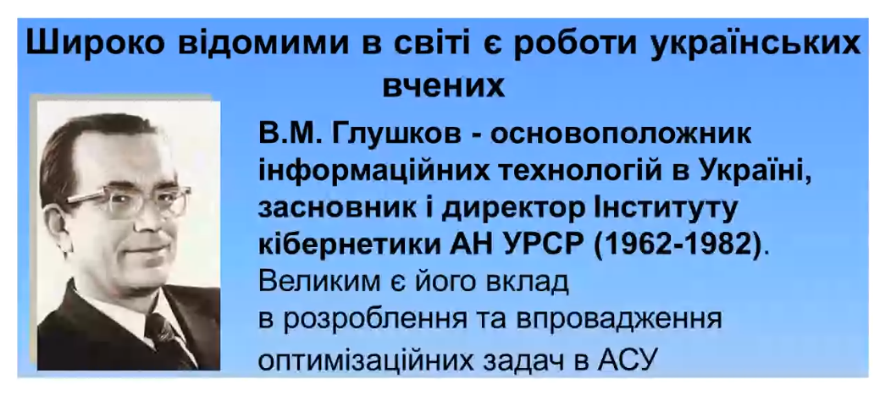

## Івахненко
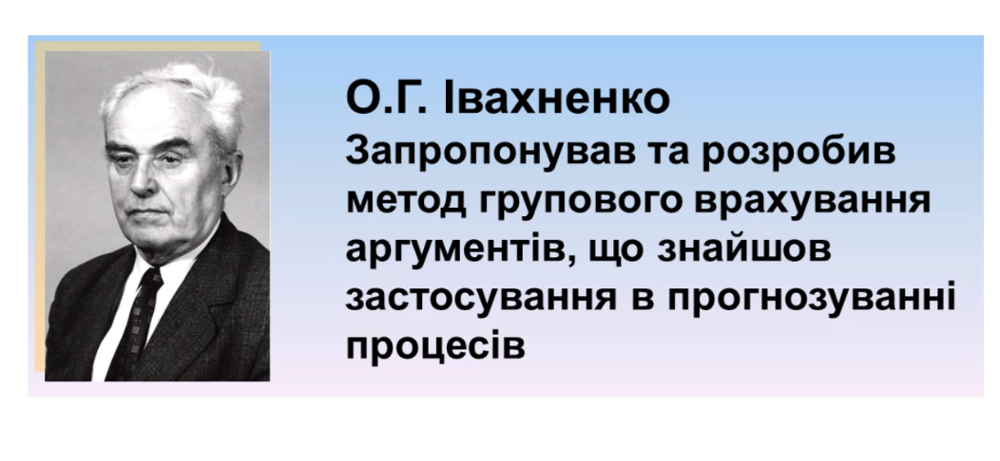

# Предмет дослідження
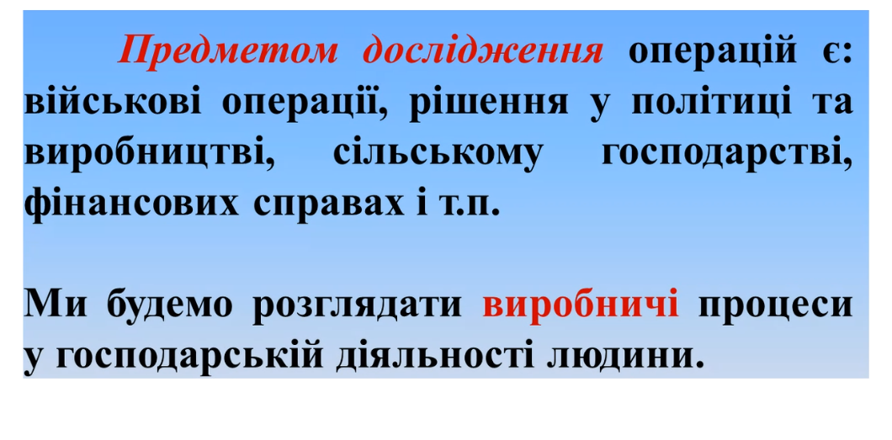

# Задачі дослідження
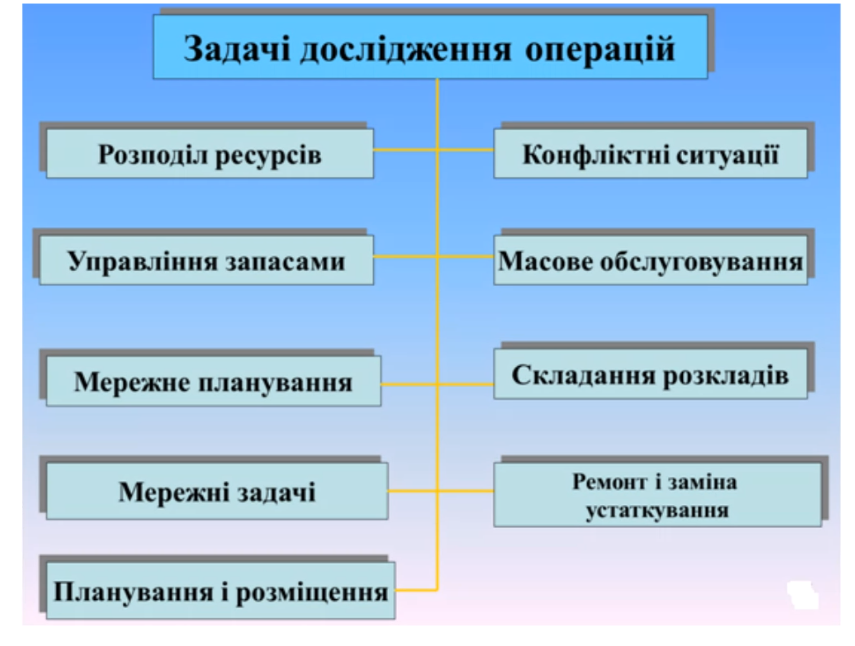

## Операція - це
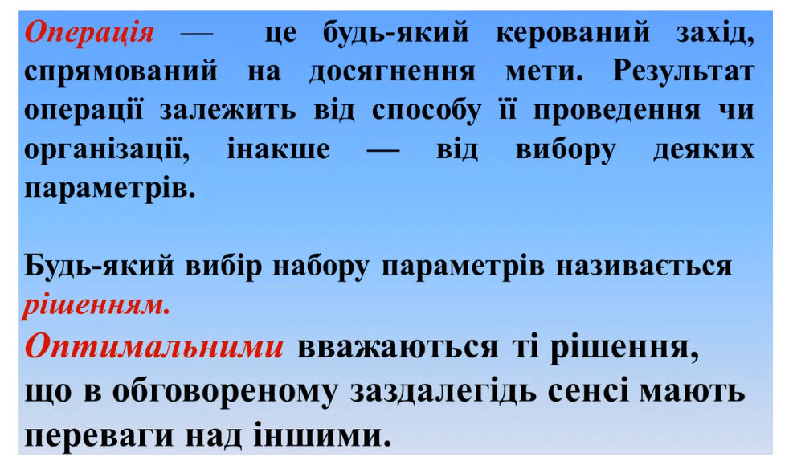

## Підсумок всього того шо було вище
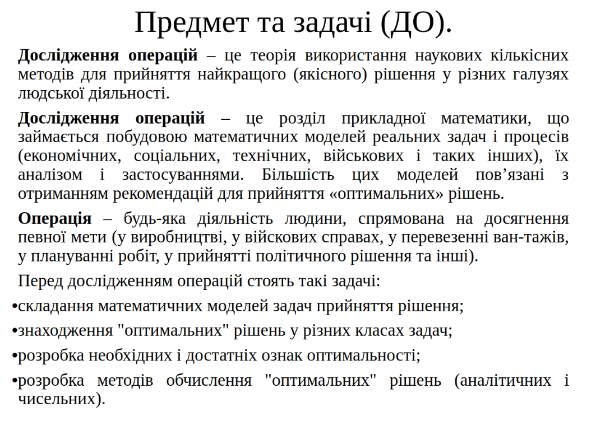

## Лінійне програмування
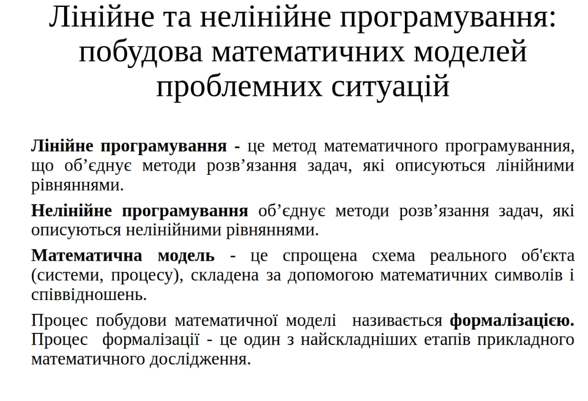

## Принципи та задачі
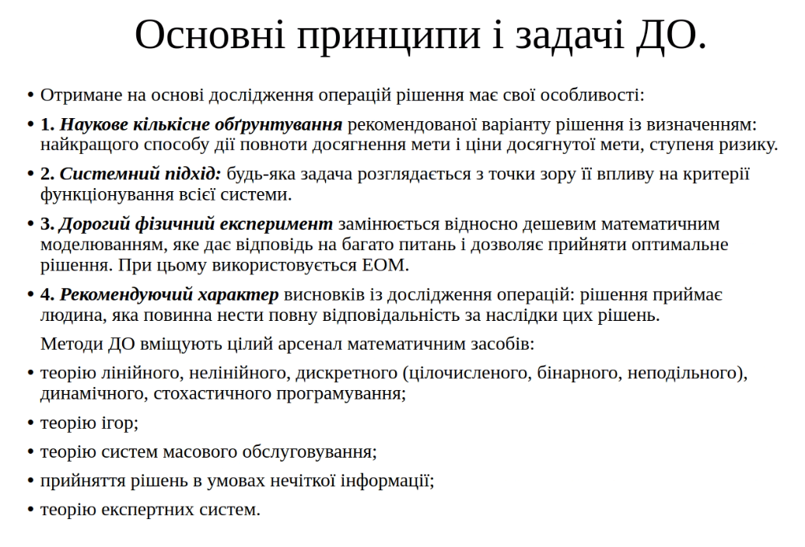

## Етапи
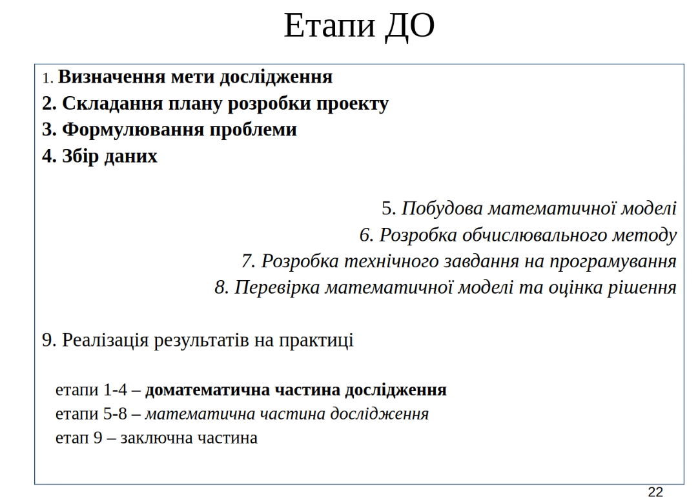

## Класи задач
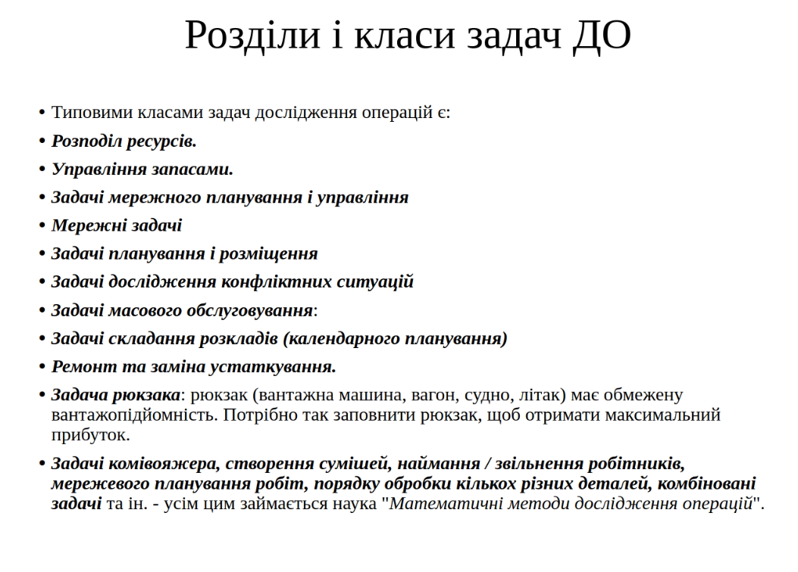

## Вимоги до мат. моделі
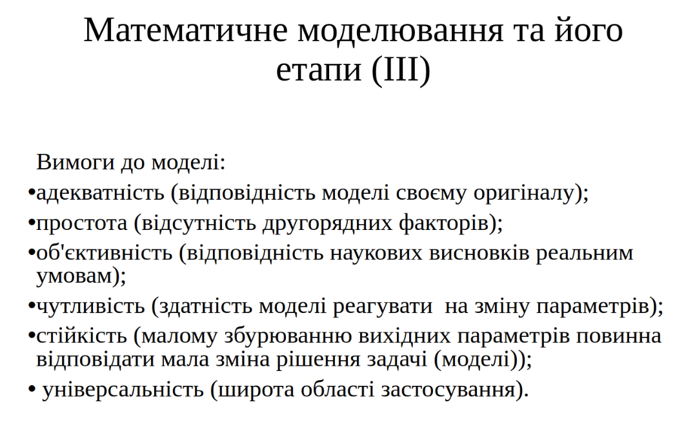

## Місце лінійного програмування
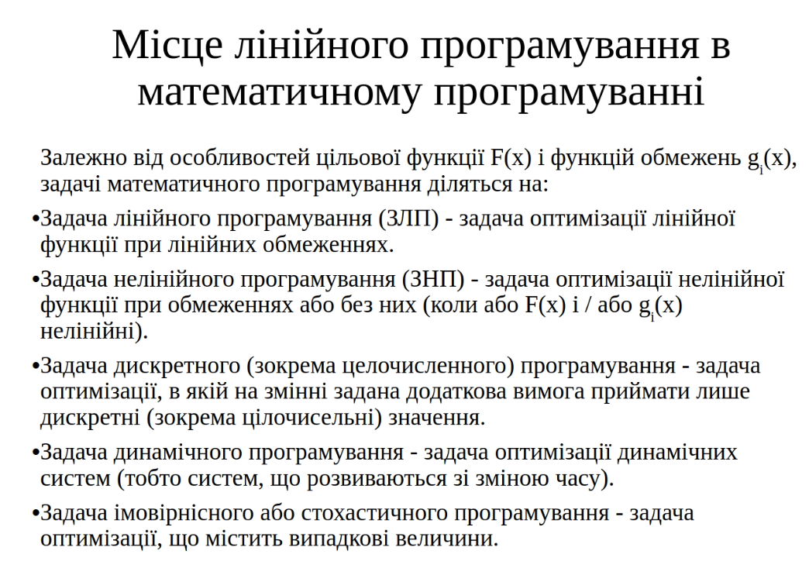

## Задача

## Основи
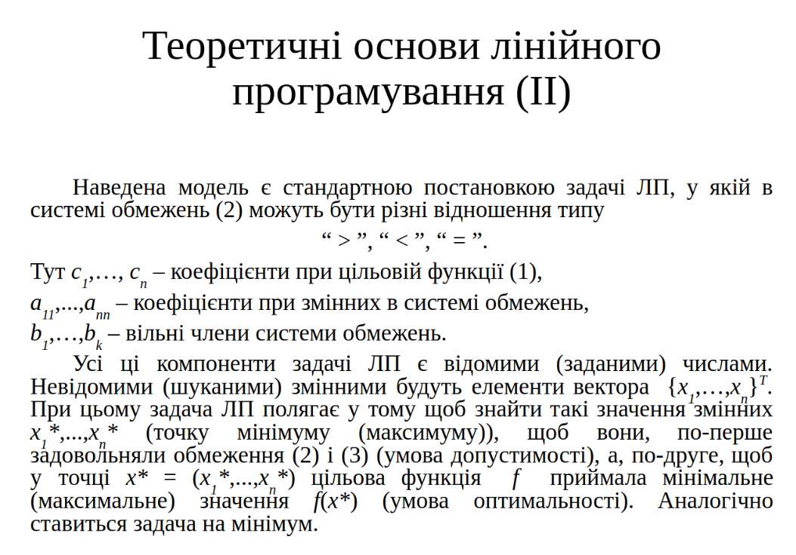
